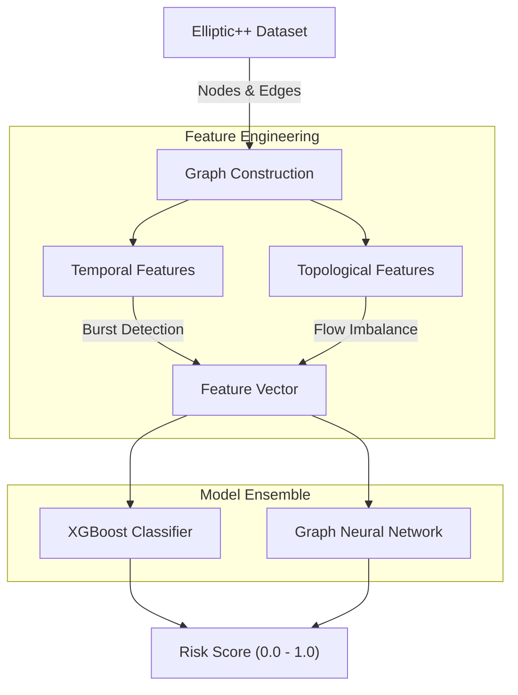

# 🕸️ Bitcoin Forensics: Deanonymizing Illicit Actors via Graph Learning


[](https://github.com/ArgaAAL/Bitcoin-Forensics-ML/stargazers)

> **A forensic framework leveraging Temporal Graph Networks (TGNs) and Gradient Boosting to detect ransomware, darknet markets, and illicit money flow on the Bitcoin blockchain.**

[](https://www.python.org/)
[](https://xgboost.readthedocs.io/)
[](https://pytorch-geometric.readthedocs.io/)

---

## 📚 Dataset & Citation

**Crucial Note:** This project utilizes the **Elliptic++ Dataset** (KDD '23).
If you use this code for research, you **must** cite the original paper:

> **Youssef Elmougy and Ling Liu. 2023.** *Demystifying Fraudulent Transactions and Illicit Nodes in the Bitcoin Network for Financial Forensics.* In Proceedings of the 29th ACM SIGKDD Conference on Knowledge Discovery and Data Mining (KDD ’23). [DOI](https://doi.org/10.1145/3580305.3599803)

The dataset can be downloaded here: **[Elliptic++ Google Drive](https://drive.google.com/drive/folders/1MRPXz79Lu_JGLlJ21MDfML44dKN9R08l?usp=sharing)**

---

## ⚡ Executive Summary

Bitcoin is not anonymous; it is pseudonymous. By analyzing the **topology** of the transaction graph, we can fingerprint the behavior of illicit actors.

**Bitcoin Forensics ML** moves beyond simple heuristic flagging. We implement a dual-stream architecture:
1.  **Topological Analysis:** Analyzing `in-degree`, `out-degree`, and graph centrality.
2.  **Temporal Pattern Recognition:** Detecting "peeling chains" (money laundering) and rapid-fire ransomware cashouts.

---

## 🏗️ System Architecture

Unlike real-time RPC scanners, this system performs **Deep Graph Analysis** on historical snapshots.



-----

## 🧩 Methodologies

### 1\. Temporal Forensics (`src/trainer.py`)

Ransomware operators often move funds in specific time windows. We engineer features to capture:

  * **Burst Activity:** High-density transaction volume within short block intervals.
  * **Temporal Spread:** The lifespan of an address from first to last seen block.
  * **Peeling Chains:** Recursive splitting of funds to obfuscate origins.

### 2\. Graph Neural Networks (`src/gnn/graph_network.py`)

We utilize **PyTorch Geometric** to learn embeddings directly from the transaction graph structure.

  * **Message Passing:** Aggregating features from neighbor nodes (wallets) to detect contamination.
  * **Node Embeddings:** Converting wallet topology into 128-d vectors for classification.

-----

## 📦 Installation

### Prerequisites

  * Python 3.10+  
  * RAM: 16GB+ recommended (Graph datasets are heavy)

### Setup

```bash
git clone [https://github.com/ArgaAAL/Bitcoin-Forensics-ML.git](https://github.com/ArgaAAL/Bitcoin-Forensics-ML.git)
cd Bitcoin-Forensics-ML
pip install -r requirements.txt
```

### 📥 Data Setup (Manual Step)

Due to size limits (GitHub), the dataset is **not included**.

1.  Download the **Elliptic++ Dataset** from the [Official Drive](https://drive.google.com/drive/folders/1MRPXz79Lu_JGLlJ21MDfML44dKN9R08l?usp=sharing).
2.  Place the CSV files in `data/elliptic_dataset/`.

-----

## 🚀 Usage

### 1\. Exploratory Data Analysis (EDA)

Analyze the graph structure and visualize illicit clusters.

```bash
python src/dataset_explorer.py
```

### 2\. Train the Forensic Model

Train the XGBoost classifier on the extracted features.

```bash
python src/trainer.py
```

*Output:*

```text
🚀 BULLETPROOF RANSOMWARE DETECTION MODEL
======================================================================
[1/6] Loading Elliptic++ Data...
[2/6] Engineering Temporal Features...
[3/6] Training XGBoost Ensemble...

📊 Results:
   Precision (Illicit): 0.96
   Recall (Illicit):    0.89
   F1-Score:            0.92
```

-----

## 📜 License & Acknowledgements

  * **Code:** MIT License.  
  * **Data:** Attribution required to Elmougy et al. (Georgia Tech).

*Part of the **Crypto-Threat-Intelligence** research suite.*
